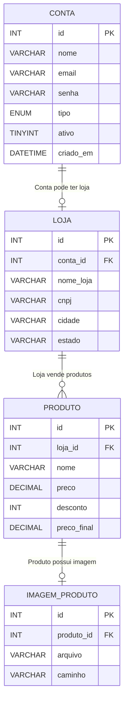

# TechnoUP
Este é um projeto artefato da disciplina de Experiência Criativa do curso de **Bacharelado em Engenharia de Software**. 
**O objetivo é** criar uma plataforma onde lojas de eletrônicos possam informatizar seus produtos em um catálogo digital.

## Links importantes

- [Doc Especificação/ Escopo](https://docs.google.com/document/d/1fP2VfiEM8JeYFwJy-tuD6_hT2eX5zqZnMf4FrSsntLs/edit?usp=sharing)
- [Trello](https://trello.com/invite/b/69b7ebbefbed913f2b15fe93/ATTIac3d810cceecb08c0f044a8607dbd1328488E02B/projetotecnoup)

## Como executar projeto

- Para inicar o projeto é necessário que o **servidor MySQL e APACHE** estejam rodando - ambos podem ser iniciados com **XAMPP**
    - Para instalar o XAMPP acesse: https://www.apachefriends.org/pt_br/index.html
- Caso ainda não tenha sido criado o banco do projeto você pode cria-lo acessando http://localhost/phpmyadmin (no caso de banco pelo xampp) e assim no menu `SQL` executar o script disponível em [prototipo.sql](./prototipo.sql)
- E em seguida você deve copiar todos os arquivos do projeto para o diretorio  do htdocs que estará possivelmente em `C:\xampp\htdocs`
- Para abrir o projeto bastará acessar [localhost/technoup](http://localhost/technoup)

## Artefatos geradas 

> Diagrama Entidade Relacionamento

