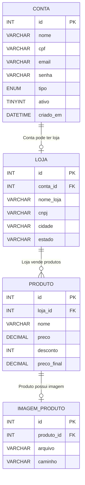

<div align="center">

# TechnoUP

[Instalação](#instalação) • [Funcionalidades](#funcionalidades) • [Modelo de Dados](#modelo-de-dados) • [Links Úteis](#links-úteis)


</div>

---

### Sumário
- [Introdução](#introdução)
- [Funcionalidades](#funcionalidades)
- [Modelo de Dados](#modelo-de-dados)
- [Pré-requisitos](#pré-requisitos)
- [Instalação](#instalação)
- [Estrutura do Projeto](#estrutura-do-projeto)
- [Links Úteis](#links-úteis)

# Introdução

**TechnoUP** é um projeto fullstack desenvolvido e apresentado na disciplina de **Experiência Criativa**, do curso de Bacharelado em Engenharia de Software. A proposta é oferecer uma plataforma onde lojas de eletrônicos possam informatizar seus produtos em um catálogo digital, centralizando cadastro de contas, lojas e produtos. O backend é uma API em **Java com Spring Boot**, que também serve o frontend e os arquivos de mídia.

# Funcionalidades

- Cadastro de contas de usuário, com diferentes tipos de acesso;
- Vínculo entre uma conta e uma loja (CNPJ, cidade e estado);
- Cadastro de produtos por loja, com preço, desconto e preço final calculado;
- Upload/associação de imagens aos produtos;
- Solicitações de avaliação de itens, conversas entre consumidores e lojas e denúncias de contas;
- Interface web estilizada com **TailwindCSS**;
- API em **Java com Spring Boot**, integrada a um banco **MySQL**.

<!--
# Modelo de Dados

O núcleo do catálogo gira em torno de quatro entidades: uma conta pode estar associada a uma loja, que por sua vez vende diversos produtos, cada um podendo ter uma imagem associada. O banco também contém tabelas para avaliações de itens e atendimento, mídias das avaliações, chats, mensagens e denúncias.


```mermaid
erDiagram
    CONTA ||--o| LOJA : "Conta pode ter loja"
    LOJA ||--o{ PRODUTO : "Loja vende produtos"
    PRODUTO ||--o| IMAGEM_PRODUTO : "Produto possui imagem"

    CONTA {
        INT id PK
        VARCHAR nome
        VARCHAR cpf
        VARCHAR email
        VARCHAR senha
        ENUM tipo
        TINYINT ativo
        DATETIME criado_em
    }

    LOJA {
        INT id PK
        INT conta_id FK
        VARCHAR nome_loja
        VARCHAR cnpj
        VARCHAR cidade
        VARCHAR estado
    }

    PRODUTO {
        INT id PK
        INT loja_id FK
        VARCHAR nome
        DECIMAL preco
        INT desconto
        DECIMAL preco_final
    }

    IMAGEM_PRODUTO {
        INT id PK
        INT produto_id FK
        VARCHAR arquivo
        VARCHAR caminho
    }
```

O script de criação do banco está disponível em [`script.sql`](script.sql), na raiz do repositório. **Use-o apenas em uma instalação nova:** ele começa com `DROP DATABASE IF EXISTS technoup` e apaga os dados existentes desse banco.
-->
# Pré-requisitos

- **Java 17 ou superior** e **MySQL**;
- Um cliente MySQL para executar o [`script.sql`](script.sql). O projeto inclui o Gradle Wrapper, então não é necessário instalar Gradle separadamente.

# Instalação

1. Inicie o **MySQL** e, em uma instalação nova, execute o [`script.sql`](script.sql) da raiz do repositório no seu cliente MySQL. O script cria o banco `technoup` e inclui dados de exemplo.
2. Se necessário, configure as variáveis de ambiente `DB_URL`, `DB_USER` e `DB_PASSWORD` em [`api\src\main\resources\application.properties`](api\src\main\resources\application.properties). Os padrões são `jdbc:mysql://localhost:3306/technoup`, `root` e senha vazia. A porta HTTP pode ser alterada com `SERVER_PORT`.
3. Na pasta `api/`, inicie o servidor com o Gradle Wrapper:

   ```powershell
   cd api
   .\gradlew.bat bootRun
   ```

   No Linux ou macOS, use `./gradlew bootRun` no lugar de `.\gradlew.bat bootRun`.
4. Abra [`http://localhost:8080/frontend/home.html`](http://localhost:8080/frontend/home.html) no navegador. O Spring Boot serve a interface, a API em `/api/` e os arquivos em `imagens/` e `videos/` no mesmo endereço.

Ao executar o servidor fora da pasta `api/`, defina `TECHNOUP_WORKSPACE` com o caminho absoluto da raiz do repositório para que os arquivos do frontend e as mídias sejam encontrados.

# Estrutura do Projeto

```
technoup/
├── api/          # Backend Java/Spring Boot e Gradle Wrapper
├── frontend/     # Interface web (HTML, CSS/TailwindCSS, JavaScript)
├── imagens/      # Imagens do projeto e arquivos enviados
├── videos/       # Vídeos enviados nas avaliações
└── script.sql    # Script de criação do banco e dados de exemplo
```

# Links Úteis

- [Documento de Especificação/Escopo](https://docs.google.com/document/d/1fP2VfiEM8JeYFwJy-tuD6_hT2eX5zqZnMf4FrSsntLs/edit?usp=sharing)
- [Quadro no Trello](https://trello.com/invite/b/69b7ebbefbed913f2b15fe93/ATTIac3d810cceecb08c0f044a8607dbd1328488E02B/projetotecnoup)

---

<div align="center">

Projeto acadêmico desenvolvido para a disciplina de Experiência Criativa — Engenharia de Software.

</div>
